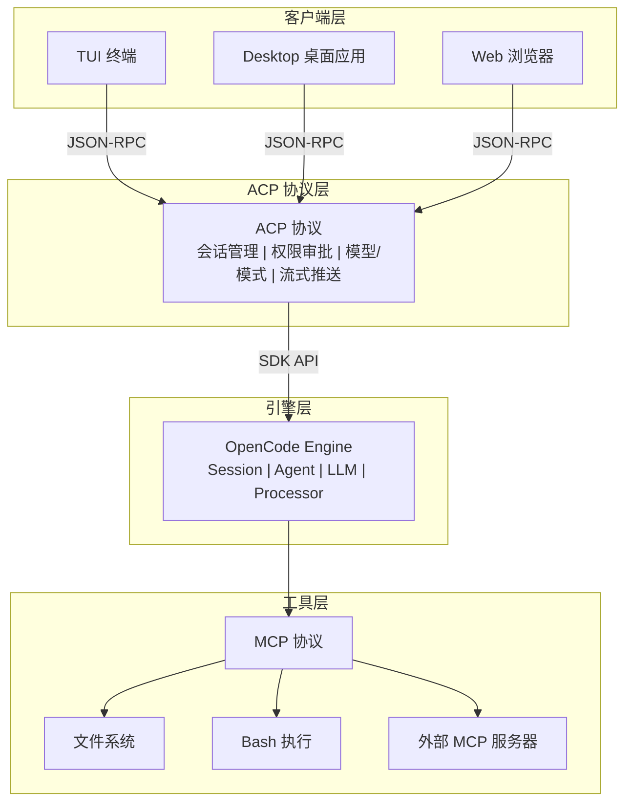
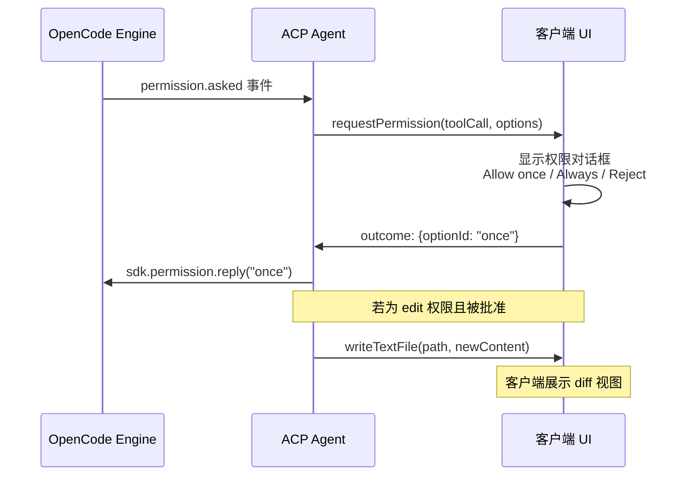

# 第 12 章　ACP 协议设计与类型体系

当 AI 编码助手从命令行走向桌面应用，一个关键问题浮出水面：**前端客户端如何与 AI 引擎通信？** MCP（Model Context Protocol）解决了工具和上下文的接入问题，但缺少会话管理、权限交互、模型选择等高层抽象。OpenCode 引入了 **ACP（Agent Client Protocol）**，为"客户端-Agent"交互定义了完整的协议层。

## 12.1 什么是 ACP（Agent Client Protocol）

ACP 是一套标准化的客户端与 AI Agent 之间的通信协议。它由 `@agentclientprotocol/sdk` 包提供类型定义和连接管理。ACP 的核心理念是：**将 AI 引擎视为一个可远程控制的服务**，客户端通过标准化的请求/响应接口与之交互。

理解 ACP 最好的方式是与 LSP（Language Server Protocol）做类比。LSP 解决了编辑器与编程语言之间的 M x N 问题——M 个编辑器和 N 种语言不再需要 M x N 个适配器，而是通过协议抽象降为 M + N 个实现。AI 编码助手领域面临完全相同的问题：每个客户端（TUI、Desktop、Web）都需要独立处理会话管理、权限协商、模型切换、流式推送、工具状态追踪。ACP 将这个 M x N 问题转化为 M + N 问题——客户端实现 ACP 客户端接口，AI 引擎实现 ACP 服务端接口，两侧自由组合。

ACP 与 LSP 共享相同的技术基因——两者都基于 JSON-RPC 协议，采用请求/响应和通知两种消息模式。LSP 用 `textDocument/completion` 请求补全，ACP 用 `prompt` 请求 AI 生成回复；LSP 用 `textDocument/didChange` 通知文件变更，ACP 用 `sessionUpdate` 通知文本增量。但关键区别在于：LSP 的交互是同步式的，而 ACP 需要处理异步流式推送（LLM 逐 token 输出）和多步协商（权限审批），消息模式更复杂。

ACP 协议覆盖的核心交互包括五个方面：会话的创建与恢复、权限请求与审批的完整往返、模型和 Agent 模式的发现与切换、消息流的实时推送（包含文本、推理过程和工具状态）、以及通过 MCP 服务器透传实现的工具能力扩展。

下面的架构图清晰地展示了 ACP 在整个系统中的位置——它是连接多种客户端与 OpenCode 引擎的协议枢纽，而 MCP 则处于引擎与外部工具之间：



这种分层架构带来了清晰的职责边界。客户端层只负责 UI 渲染和用户交互，不需要理解 LLM 调用细节。引擎层专注于 AI 能力的编排，不需要关心 UI 实现。ACP 协议层则充当两者之间的契约，保证任何实现了 ACP 客户端接口的前端都能获得一致的 AI 编码助手体验。

## 12.2 ACPSessionState 类型

> **源码位置**：packages/opencode/src/acp/types.ts

`ACPSessionState` 定义了 ACP 层面维护的会话状态：

```typescript
// 文件: packages/opencode/src/acp/types.ts L5-16
export interface ACPSessionState {
  id: string                  // 会话唯一标识
  cwd: string                 // 工作目录（项目路径）
  mcpServers: McpServer[]     // 客户端注册的 MCP 服务器列表
  createdAt: Date             // 会话创建时间
  model?: {                   // 当前使用的模型
    providerID: ProviderID    // 提供商标识（如 "anthropic"）
    modelID: ModelID          // 模型标识（如 "claude-sonnet-4-20250514"）
  }
  variant?: string            // 模型变体（如速度/质量偏好）
  modeId?: string             // 当前 Agent 模式（如 "build"、"plan"）
}
```

这个类型的设计体现了几个关键决策：

**工作目录绑定**：每个 ACP 会话都绑定到一个具体的 `cwd`。这与 OpenCode 的项目感知能力一致——不同项目的配置、权限规则和 MCP 服务器可能完全不同。

**MCP 服务器传递**：客户端可以向引擎注册自己的 MCP 服务器。例如，Desktop 应用可能提供了本地文件系统工具或 IDE 集成工具，通过 ACP 传递给引擎使用。

**模型与模式分离**：`model` 决定使用哪个 LLM，`modeId` 决定使用哪个 Agent（如 build、plan、explore）。这种分离让用户可以在同一模型下切换工作模式，或在同一模式下切换模型。

## 12.3 ACPConfig 配置

```typescript
// 文件: packages/opencode/src/acp/types.ts L18-24
export interface ACPConfig {
  sdk: OpencodeClient          // OpenCode SDK 客户端实例
  defaultModel?: {             // 默认模型配置
    providerID: ProviderID
    modelID: ModelID
  }
}
```

`ACPConfig` 极其精简，只包含两个字段：

- **`sdk`**：OpenCode 的 SDK 客户端，提供对引擎所有功能的 API 访问。这是 ACP Agent 与 OpenCode 核心交互的唯一通道。
- **`defaultModel`**：可选的默认模型。如果未指定，Agent 会从项目配置中读取默认模型设置。

这种设计将 ACP 层定位为一个**薄适配层**——它不重复 OpenCode 引擎的配置，而是通过 SDK 代理所有操作。

## 12.4 消息格式转换

ACP 协议定义了自己的消息格式，与 OpenCode 内部的消息格式不同。`ACP.Agent` 类负责在两者之间转换。

**输入方向（客户端 → 引擎）**：ACP 的 `PromptRequest` 包含多种内容类型，需要转换为 OpenCode 的内部格式：

```typescript
// 文件: packages/opencode/src/acp/agent.ts L1304-1346
for (const part of params.prompt) {
  switch (part.type) {
    case "text":
      // 处理 audience 注解：synthetic/ignored 映射
      const audience = part.annotations?.audience
      const forAssistant = audience?.length === 1 && audience[0] === "assistant"
      const forUser = audience?.length === 1 && audience[0] === "user"
      parts.push({
        type: "text",
        text: part.text,
        ...(forAssistant && { synthetic: true }),
        ...(forUser && { ignored: true }),
      })
      break

    case "image":
      // 图片转为 data URL 格式的文件部分
      parts.push({
        type: "file",
        url: `data:${part.mimeType};base64,${part.data}`,
        filename,
        mime: part.mimeType,
      })
      break

    case "resource_link":
      // 资源链接解析为文件路径
      parts.push(parseUri(part.uri))
      break
  }
}
```

**输出方向（引擎 → 客户端）**：引擎的事件流通过 `sessionUpdate` 推送给客户端，包括文本增量（`agent_message_chunk`）、思考过程（`agent_thought_chunk`）、工具调用状态（`tool_call_update`）等。

一个重要的细节是 **audience 注解** 的处理。ACP 使用 `audience: ["assistant"]` 表示合成内容（仅供模型参考），`audience: ["user"]` 表示被忽略的内容。OpenCode 内部则使用 `synthetic` 和 `ignored` 布尔标志。这种映射保证了语义的完整传递。

## 12.5 权限审批的完整往返

权限审批是 ACP 协议中最复杂的交互流程之一。它涉及引擎、ACP Agent 和客户端三方之间的多步协调，任何一步出错都可能导致工具执行被阻塞。

整个流程始于引擎遇到需要权限的工具调用。例如当 Agent 试图编辑一个文件时，引擎不会直接执行操作，而是发布一个 `permission.asked` 事件。ACP Agent 通过事件订阅循环捕获到这个事件后，调用 `connection.requestPermission()` 将权限请求转发给客户端。客户端收到请求后，在 UI 上展示一个对话框，向用户呈现三个选项：Allow once（允许本次）、Always allow（始终允许）和 Reject（拒绝）。

用户做出选择后，客户端将结果返回给 ACP Agent，Agent 再调用 `sdk.permission.reply()` 将最终决定传达给引擎。引擎根据回复决定是执行工具调用还是跳过。



对于 `edit` 类型的权限，流程还有一个额外的步骤：当用户批准编辑后，ACP Agent 会读取目标文件的当前内容，将 diff 应用后得到新内容，然后调用 `connection.writeTextFile()` 将新内容推送给客户端。这让 Desktop 应用能够在用户批准编辑的同时展示一个实时的 diff 视图，用户可以清楚地看到即将发生的文件变更。

源码中权限处理的核心在于队列化机制。`ACP.Agent` 类维护了一个 `permissionQueues` Map，每个会话 ID 对应一个 Promise 链：

```typescript
// 文件: packages/opencode/src/acp/agent.ts L143-263
private permissionQueues = new Map<string, Promise<void>>()

// 在 handleEvent 中处理 permission.asked 事件
const prev = this.permissionQueues.get(permission.sessionID) ?? Promise.resolve()
const next = prev.then(async () => {
  // 向客户端请求权限
  const res = await this.connection.requestPermission({
    sessionId: permission.sessionID,
    toolCall: { /* ... */ },
    options: this.permissionOptions,
  })
  // 根据用户选择回复引擎
  await this.sdk.permission.reply({
    requestID: permission.id,
    reply: res.outcome.optionId as "once" | "always" | "reject",
    directory,
  })
}).finally(() => {
  if (this.permissionQueues.get(permission.sessionID) === next) {
    this.permissionQueues.delete(permission.sessionID)
  }
})
this.permissionQueues.set(permission.sessionID, next)
```

每个新的权限请求都被追加到前一个请求的 Promise `.then()` 链上，形成串行执行。`finally()` 中的清理逻辑只在当前 Promise 仍是队列尾部时才删除条目，这避免了在并发场景下误清理仍有后续请求的队列。这种基于 Promise 链的队列化模式比显式的队列数据结构更简洁，也天然支持异步操作。

## 12.6 与 MCP 协议的关系

ACP 和 MCP 是互补的两个协议，各有分工：

| 维度 | MCP | ACP |
|------|-----|-----|
| 抽象层级 | 工具与上下文 | 会话与控制 |
| 主要交互 | 调用工具、读取资源 | 管理会话、权限审批 |
| 消息方向 | Agent → 工具服务器 | 客户端 → Agent |
| 状态管理 | 无状态 | 有状态（会话） |
| 标准化程度 | 行业标准 | OpenCode 定义 |

在 OpenCode 中，ACP 可以透传客户端的 MCP 服务器配置。当 Desktop 应用通过 ACP 创建会话时，可以携带自己的 MCP 服务器列表：

```typescript
// 文件: packages/opencode/src/acp/agent.ts L570-593
async newSession(params: NewSessionRequest) {
  // params.mcpServers 包含客户端注册的 MCP 服务器
  const state = await this.sessionManager.create(
    params.cwd,
    params.mcpServers,  // 透传给引擎
    model
  )
  // ...
}
```

这种设计让 Desktop 应用可以扩展引擎的工具能力——例如提供 IDE 级别的代码导航工具或调试器集成。客户端不仅是 AI 能力的消费者，也可以是工具能力的提供者。

## 12.7 事件订阅循环与流式推送

ACP Agent 的事件处理是整个协议运转的核心引擎。`Agent` 类在构造时就启动了一个永久运行的事件订阅循环：

```typescript
// 文件: packages/opencode/src/acp/agent.ts L167-182
private async runEventSubscription() {
  while (true) {
    if (this.eventAbort.signal.aborted) return
    const events = await this.sdk.global.event({
      signal: this.eventAbort.signal,
    })
    for await (const event of events.stream) {
      if (this.eventAbort.signal.aborted) return
      await this.handleEvent(payload as Event)
    }
  }
}
```

循环通过 `AbortController` 管理生命周期，使用 `for await...of` 消费异步事件流。`handleEvent` 根据事件类型分发：`permission.asked` 触发权限审批，`message.part.updated` 转为 `tool_call_update`，`message.part.delta` 转为 `agent_message_chunk` 或 `agent_thought_chunk`。对于 bash 工具输出，通过 `bashSnapshots` Map 记录哈希值实现去重，避免推送重复数据。

## 12.8 实战：理解 ACP 的设计动机

假设你在使用 OpenCode Desktop 应用。你打开一个项目，开始与 AI 对话。这个看似简单的过程涉及大量交互：

1. **会话初始化**：Desktop 调用 `newSession`，传入项目路径和 MCP 服务器
2. **模型发现**：引擎返回可用模型列表和当前默认模型
3. **模式选择**：引擎返回可用 Agent（build/plan）列表
4. **用户输入**：Desktop 将用户消息（可能包含图片、文件引用）通过 `prompt` 发送
5. **实时反馈**：引擎通过事件流推送文本增量、工具调用状态
6. **权限询问**：当 Agent 需要写文件时，通过 ACP 向 Desktop 请求用户授权
7. **会话恢复**：用户关闭再打开应用，通过 `loadSession` 恢复历史对话

ACP 将这些模式标准化，任何实现了 ACP 的客户端都能获得一致的体验。与 Cursor 和 GitHub Copilot 将 UI 和引擎紧耦合相比，OpenCode 的 ACP 设计天然支持"一个引擎，多个前端"——社区只需遵循 ACP 协议就能构建全新的客户端体验。

## 本章要点

- ACP（Agent Client Protocol）定义了客户端与 AI Agent 之间的标准化通信协议，处于 MCP 之上、UI 之下的中间层，其设计理念与 LSP 一脉相承——都是通过协议抽象将 M x N 问题转化为 M + N 问题
- ACP 基于 JSON-RPC，支持请求/响应和通知两种消息模式，覆盖会话生命周期、权限协商、模型/模式选择、流式更新和工具状态追踪五大交互
- `ACPSessionState` 将会话与工作目录、MCP 服务器、模型和模式绑定，实现完整的上下文隔离
- `ACPConfig` 采用薄适配层设计，通过 SDK 代理所有操作，避免配置重复
- 消息格式转换处理了 audience 注解、图片编码、资源链接等多种内容类型的双向映射
- 权限审批流程涉及引擎、ACP Agent 和客户端三方协调，通过基于 Promise 链的每会话队列化机制保证串行处理，edit 权限还额外推送文件新内容以支持 diff 展示
- 事件订阅循环通过 AbortController 管理生命周期，bash 输出通过哈希去重避免重复推送
- ACP 可透传客户端的 MCP 服务器，让前端应用不仅是 AI 能力的消费者，也可以是工具能力的提供者
